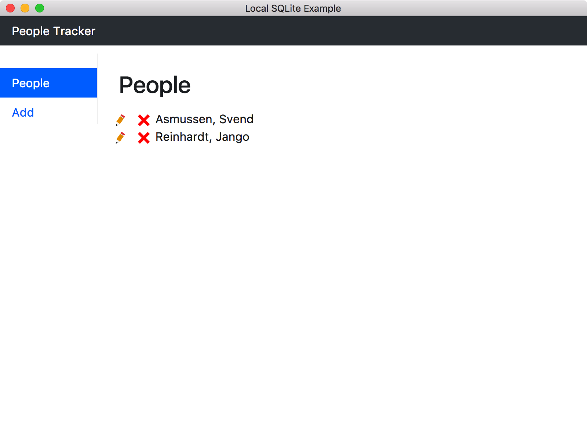
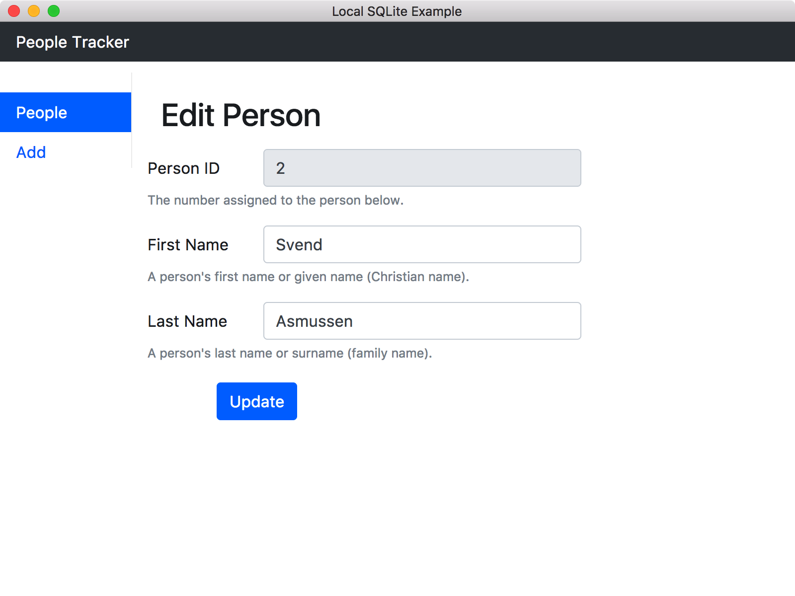
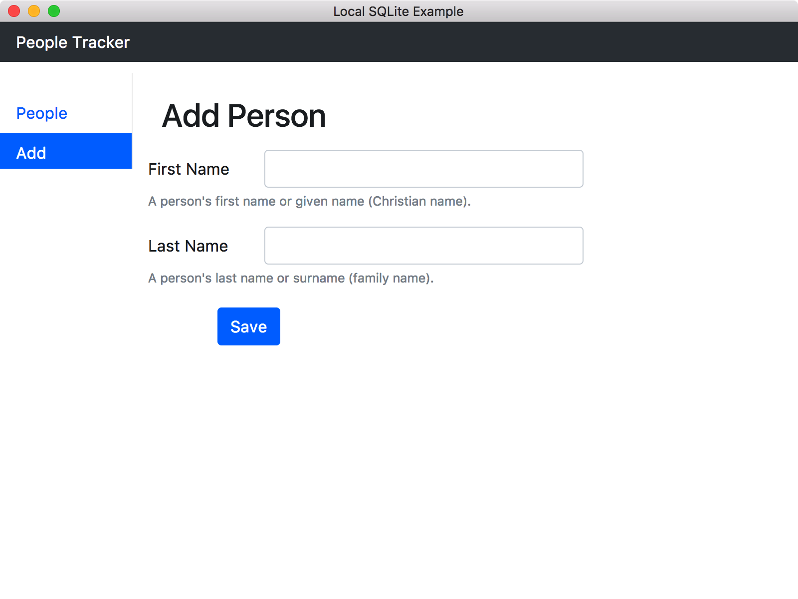

This project used the skeleton created by Patrick Moffit at https://github.com/patrickmoffitt/local-sqlite-example and was changed to use [knex.js](http://knexjs.org/)

How to Build an Electron App with a Local SQLite3 Database That's Portable.
------------------------------------------------------------------------

This project demonstrates how to install and use a local SQLite3 database in Electron using [knex.js](http://knexjs.org/). 

Getting started
---------------
 * install npm using this guide https://docs.npmjs.com/downloading-and-installing-node-js-and-npm
 * create a directory on your computer and copy/clone this repository (`git clone https://github.com/viktor-c/local-sqlite-knex`) or download and extract .zip file
 * open terminal, cd into the folder of this project
 * Then run
   - `npm install`
   - `npm start`

Quick Code Tour
---------------

 - The code entry point is in **package.json** under the key "main". The value is "main.js"
 - **main.js** calls model.initDb() from **model.js** which creates a new SQLite3 database from **schema.sql**. A callback creates a BrowserWindow and loads **index.html**.
 - **index.html** loads Bootstrap's CSS in the &lt;head&gt; tag and **renderer.js** after the closing &lt;body&gt; tag.
 - **renderer.js** loads Cheerio, jQuery, Bootstrap and it's dependency; Tether.
 - A [composed HTML pattern](https://github.com/patrickmoffitt/composed-html-example) is used to load the markup.
 - The application's database work is all done in **model.js**. Here you'll find functions to select, insert, update, and delete records. 
 - The application opens with a list of people. Click a red X to delete a person's record.

 
 - Click a pencil (shown above) to edit a person:

 
 - Click Add in the left rail to add a new person record:

 

Uninstalling
-------------

 Please note that running this application will install a tiny SQLite database in the folder returned by electron.app.getPath('userData'). To uninstall simply delete this folder.
